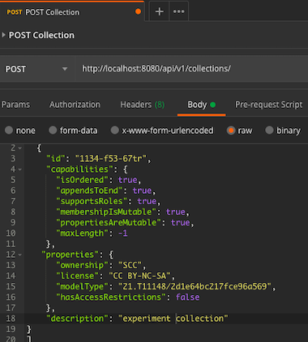
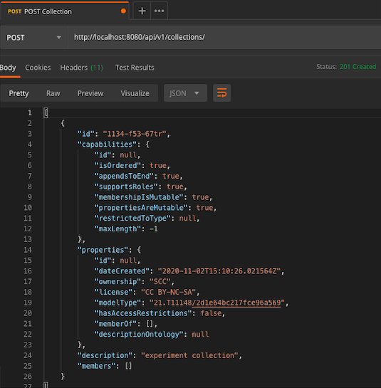
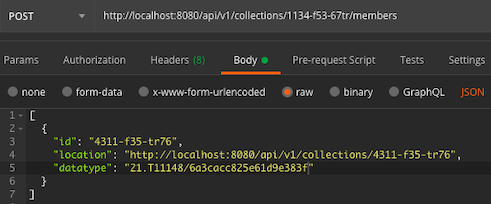
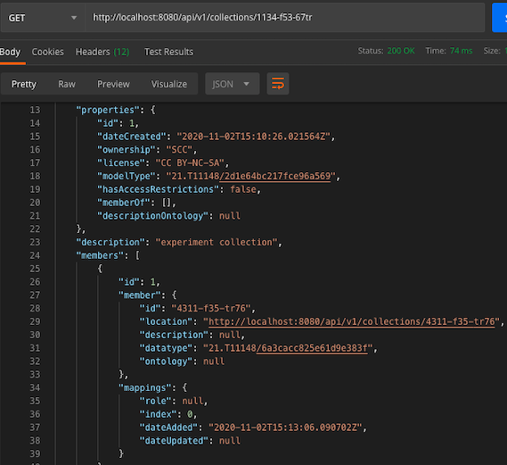
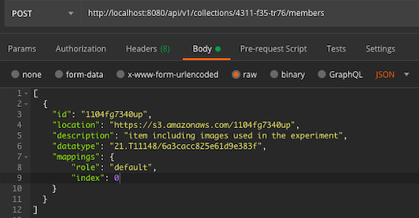

+++++++++++++++++++++++++++++++++++++++++++
4. How can the Collection API be used? 
+++++++++++++++++++++++++++++++++++++++++++
**************
4.1 Example
**************
In this section, an example of Collection API is introduced. Let’s assume we want to publish a data set of an experiment. The set includes raw data, implementation and results. These collections are sub-collections of the “experiment” collection. The “rawData” collection includes one item called “images”, which represents a set of images used in the experiment and which is stored in a research data repository. As it exists two implementations of the experiment based on two different methods, the “implementation” collection includes two items “method1” and “method2”, which are stored in two Git repositories. The “result” collection includes two sub-collections “result1” and “result2”, which includes the results of the experiment based on both methods in form of documents such as images, Excel sheets, etc. Moreover, the user wants to store the item of the method-implementation in the results sub-collections to be able to check on which implementation the results are generated. As the Collection API offers the possibility to share items between different collections, each result sub-collection includes also the implementation item of the used method. The figure below describes how the collections and their items should look like.

.. figure:: images/example.png
   :align: center
   
   Figure 4: Example

In the next sections, we will describe how to build up the above example using the Collection API service.

****************************
4.2 Creation of collections
****************************
Using the POST operation http://localhost:8070/api/v1/collections, we have the possibility to create collections one by one or all together. As an input, a JSON object including the collection attributes is needed. In the above described example, six collections should be created. Figure 5 below includes an example of creating the “experiment” collection and the response of this operation is represented in Figure 6. The non-given attributes are filled out with the default values. Moreover, the created date is automatically generated. As the experiment collection is not an item of another collection and has no items yet, the value of both attributes “memberOf” and “members” is an empty list. The five remaining collections “rawData”, “implementation”, “results”, “result1” and “result2” can be created in the same way.

   
   Figure 5: Creation of the experiment collection

   
   Figure 6: Response of the POST experiment collection
  
********************************
4.3 Creation of sub-collections
********************************
In order to add the relationship between “experiment” collection and other collections, we should add the sub-collections as items to the parent collection using the following POST operation: http:// localhost:8070/api/v1/collections/{collection_identifier}/members. To run this operation, “id”, “location” and “datatype” are mandatory fields. Figure 7 includes an example of the JSON object needed while adding “rawData” collection to the “experiment” collection.

   
   Figure 7: Add „rawData“ as a sub-collection

After executing this operation, “rawData” collection is added to the member list of the “experiment” collection as shown in Figure 8, which includes a response of the GET collection operation.

   
   Figure 8: Get „experiment“ collection

The remaining collections can be added the same way as sub-collections to the “experiment” and “results” collection.

*************************************
4.4	Creation of collection items
*************************************

In order to create a new member and add it to a collection, the same POST operation mentioned in 4.3 should be performed: http://localhost:8070/api/v1/collections/{collection_identifier}/members. Figure 9 includes an example of adding item “images” to collection “rawData”.

   
   Figure 9: Creation of „images“ item

Moreover, item “method1” is a shared item of two collections and Figure 10 includes an example of a JSON object, which should be added to both collections using the POST operation. Only the identifier of the collection, to which the item is added, should be modified.

.. figure:: images/addMethod1ToImplementation.png
   :width: 700
   :alt: Add “method1” item to the “implementation” collection
   
   Figure 10: Add “method1” item to the “implementation” collection

Other REST APIS are available such as listing collections and items, updating or removing them. Moreover, to access the visualization of the above created collections, items and relationships between them, you can browse to http://localhost:8070/static/overview.html. Figure 11 includes the example overview. Blue ovals represent collections and orange ones represent member items.

.. figure:: images/overview.png
   :width: 700
   :alt: Overview
   
   Figure 11: Overview

To have more information about the collections or items, the user has just to click on the oval. Figure 12 includes an example of a collection description. Moreover, you can search a collection or an item by writing its identifier in the search box.

.. figure:: images/collectionDescription.png
   :width: 700
   :alt: Collection description
   
   Figure 12: Collection description

In order to build the above described example, a short tutorial is available under https://www.katacoda.com/kitdm/scenarios/collection-api
